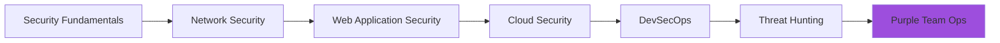

# 
<div align="center">
  
</div>

<div align="center">
  
</div>

<div align="center">
  <a href="https://github.com/Abuzkah">
    
  </a>
  <a href="https://github.com/Abuzkah?tab=followers">
    
  </a>
  <a href="https://github.com/Abuzkah?tab=repositories">
    
  </a>
</div>

---

## 💜 **About Me**


```javascript
const securityEngineer = {
    name: "Abubakar Nasteh",
    role: "Cyber Security Analyst",
    location: "127.0.0.1",
    
    skills: {
        offensive: ["Penetration Testing", "Web App Security", "Network Recon"],
        defensive: ["SIEM Management", "Incident Response", "Log Analysis"],
        purple: ["Threat Emulation", "Security Automation", "Detection Engineering"]
    },
    
    languages: ["Python", "JavaScript", "Bash", "PowerShell"],
    
    certifications: {
        current: ["CompTIA Security+", "eJPT"],
        pursuing: ["OSCP", "CySA+"]
    },
    
    currentFocus: "Building detection rules based on red team tactics",
    
    funFact: "I break things responsibly to make them stronger 🔨🔧"
};
```

## 🎯 **Current Objectives**

- 🔴 **Red Team:** Learning advanced exploitation techniques and custom payload development
- 🔵 **Blue Team:** Implementing detection strategies for common attack patterns
- 💜 **Purple Team:** Building automated security testing pipelines and threat simulations
- 📚 **Learning:** Cloud security, container security, and MITRE ATT&CK framework

## 🛠️ **Technical Arsenal**

<div align="center">

### **Security Tools**


### **Programming & Scripting**


### **Cloud & DevOps**


</div>

## 📊 **GitHub Statistics**

<div align="center">
  
  
</div>

<div align="center">
  
</div>

## 🚀 **Featured Security Projects**

<div align="center">
  
| Project | Description | Tech Stack |
|---------|-------------|------------|
| 🔍 **[Network Scanner](https://github.com/Abuzkah/network-scanner)** | Multi-threaded network discovery and port scanning tool | Python, Nmap, AsyncIO |
| 🛡️ **[WAF Bypass Toolkit](https://github.com/Abuzkah/waf-bypass)** | Collection of WAF bypass techniques and payloads | Python, Requests, SQLMap |
| 📊 **[SIEM Alert Tuner](https://github.com/Abuzkah/siem-tuner)** | Automated false positive reduction for SIEM alerts | Python, Splunk SDK, ML |
| 🔐 **[Password Auditor](https://github.com/Abuzkah/pass-audit)** | Enterprise password policy compliance checker | Go, LDAP, Hashcat |
| 🎯 **[Phishing Detector](https://github.com/Abuzkah/phish-detect)** | ML-based phishing email and URL detector | Python, Scikit-learn, Flask |
| 🔄 **[Incident Responder](https://github.com/Abuzkah/ir-toolkit)** | Automated incident response and forensics toolkit | PowerShell, Python |

</div>

## 🏆 **Achievements & Certifications**

<div align="center">

### **Active Certifications**


### **In Progress**


</div>

## 🎮 **CTF & Training Platforms**

<div align="center">

| Platform | Progress | Rank/Level | Focus |
|----------|----------|------------|-------|
| **TryHackMe** |  | Top 5% | Offensive Security |
| **HackTheBox** |  | Hacker | Penetration Testing |
| **LetsDefend** |  | SOC Analyst | Blue Team |
| **CyberDefenders** |  | Advanced | DFIR |
| **PentesterLab** |  | Pro | Web Security |

</div>

## 📚 **Recent Learning Path**



## 💼 **Work Experience**

- 🔒 **Security Analyst** @Esoteric Strats *(2024 - Present)*
  - Incident response and threat hunting
  - Security tool implementation and tuning
  - Purple team exercises coordination

- 🔍 **Junior Penetration Tester** @Rozalla Inc  *(2023 - 2024)*
  - Web application and network penetration testing
  - Security assessment reports
  - Vulnerability remediation guidance

- 💻 **IT Support Specialist** @HDF *(2022 - 2023)*
  - Security-focused IT support
  - Basic security implementations
  - User security awareness training

## 📝 **Latest Blog Posts & Write-ups**

- 📌 [Purple Team Exercise: Detecting Kerberoasting Attacks](https://medium.com/@yourusername)
- 📌 [From SQLi to RCE: A HackTheBox Walkthrough](https://medium.com/@yourusername)
- 📌 [Building a Home SOC Lab with Elastic Stack](https://medium.com/@yourusername)
- 📌 [OSCP Prep: My Journey and Resources](https://medium.com/@yourusername)
- 📌 [Automating Security Tasks with Python](https://medium.com/@yourusername)

## 🤝 **Connect With Me**

<div align="center">
  
[](https://linkedin.com/in/yourusername)
[](https://twitter.com/yourusername)
[](https://medium.com/@yourusername)
[](https://discord.gg/yourusername)
[](mailto:your.email@example.com)

</div>

## 💡 **Fun Facts**

- 🎯 Captured my first flag in 2022 and got addicted to CTFs
- 📖 Currently reading: "The Art of Deception" by Kevin Mitnick
- 🔐 Favorite vulnerability type: Logic flaws and race conditions
- ☕ Powered by coffee and curiosity
- 🎮 When not hacking: Gaming and building home labs

---

<div align="center">
  
### 💜 **Purple Team Philosophy**
  
*"The best defense is understanding the offense, and the best offense respects the defense."*

```python
while True:
    learn()
    hack()
    defend()
    automate()
    repeat()
```


</div>
