# 
<div align="center">
  
</div>

<div align="center">
  
</div>

<br/>

<div align="center">
  <a href="https://github.com/bakr0x01">
    
  </a>
  <a href="https://github.com/bakr0x01?tab=followers">
    
  </a>
  <a href="https://github.com/bakr0x01?tab=repositories">
    
  </a>
  <a href="https://tryhackme.com/p/Bakr0x01">
    
  </a>
</div>

<br/>

---


<br/>

##  **About Me**


```javascript
const securityAnalyst = {
    name: "Abubakar Nasteh",
    handle: "Bakr0x01",
    role: "Cybersecurity Analyst",
    location: "127.0.0.1 | localhost",
    timezone: "EAT (UTC+3)",
    
    expertise: {
        offensive: [
            "🎯 Penetration Testing",
            "🕸️ Web Application Security",
            "🔍 Network Reconnaissance",
            "💉 Exploit Development"
        ],
        defensive: [
            "🛡️ SIEM Management (Splunk, ELK)",
            "🚨 Incident Response & Forensics",
            "📊 Log Analysis & Correlation",
            "🔐 Security Hardening"
        ],
        purple: [
            "⚔️ Threat Emulation & ATT&CK",
            "🤖 Security Automation",
            "📡 Detection Engineering",
            "🎭 Adversary Simulation"
        ]
    },
    
    arsenal: {
        languages: ["Python", "Bash", "PowerShell", "JavaScript", "Go"],
        frameworks: ["Metasploit", "Burp Suite", "Cobalt Strike"],
        cloud: ["AWS", "Azure", "Docker", "Kubernetes"],
        databases: ["MySQL", "PostgreSQL", "MongoDB"]
    },
    
    certifications: {
        active: ["CompTIA Security+", "eJPT", "Google Cybersecurity"],
        inProgress: ["OSCP 💀", "CySA+"]
    },
    
    currentMission: "Building detection rules based on red team TTPs",
    lifePhilosophy: "Break it. Secure it. Automate it. Repeat. 🔄",
    
    dailyRoutine: function() {
        while (awake) {
            coffee++;
            learn();
            hack();
            defend();
            document();
        }
    }
};
```

<br/>

## 🎯 **Mission Objectives 2025**

<table>
<tr>
<td width="50%">

### 🔴 **RED TEAM**
```yaml
focus:
  - Advanced Exploitation Techniques
  - Custom Payload Development
  - Active Directory Attacks
  - Post-Exploitation & Pivoting
  - Evasion & Anti-Forensics

tools:
  - Cobalt Strike
  - Covenant C2
  - Custom Implants
```

</td>
<td width="50%">

### 🔵 **BLUE TEAM**
```yaml
focus:
  - Detection Rule Development
  - Threat Hunting Methodologies
  - SIEM Optimization
  - Incident Response Playbooks
  - Log Source Integration

tools:
  - Splunk Enterprise
  - Elastic Stack (ELK)
  - Wazuh HIDS
```

</td>
</tr>
<tr>
<td colspan="2">

### 💜 **PURPLE TEAM CONVERGENCE**
```yaml
objective: Bridge the gap between offensive and defensive operations
activities:
  - 🎭 Adversary Emulation using MITRE ATT&CK
  - 🔬 Security Control Validation
  - 📊 Threat Intelligence Integration
  - 🤖 Automated Security Testing Pipelines
  - 📈 Continuous Security Improvement
```

</td>
</tr>
</table>

<br/>


<br/>

## 🛠️ **Technical Arsenal & Weaponry**

<div align="center">

### **🔐 Security & Pentesting Tools**

<table>
<tr>
<td align="center" width="96">

<br>Kali Linux
</td>
<td align="center" width="96">

<br>Metasploit
</td>
<td align="center" width="96">

<br>Burp Suite
</td>
<td align="center" width="96">

<br>Nmap
</td>
<td align="center" width="96">

<br>Wireshark
</td>
<td align="center" width="96">

<br>OWASP ZAP
</td>
</tr>
<tr>
<td align="center" width="96">

<br>Splunk
</td>
<td align="center" width="96">

<br>ELK Stack
</td>
<td align="center" width="96">

<br>John
</td>
<td align="center" width="96">

<br>Hashcat
</td>
<td align="center" width="96">

<br>SQLMap
</td>
<td align="center" width="96">

<br>Hydra
</td>
</tr>
</table>

### **💻 Programming & Scripting**

<table>
<tr>
<td align="center" width="96">

<br>Python
</td>
<td align="center" width="96">

<br>JavaScript
</td>
<td align="center" width="96">

<br>Bash
</td>
<td align="center" width="96">

<br>Go
</td>
<td align="center" width="96">

<br>PowerShell
</td>
<td align="center" width="96">

<br>C/C++
</td>
</tr>
</table>

### **☁️ Cloud & DevSecOps**

<table>
<tr>
<td align="center" width="96">

<br>Docker
</td>
<td align="center" width="96">

<br>Kubernetes
</td>
<td align="center" width="96">

<br>AWS
</td>
<td align="center" width="96">

<br>Azure
</td>
<td align="center" width="96">

<br>Git
</td>
<td align="center" width="96">

<br>GitHub Actions
</td>
</tr>
</table>

</div>

<br/>


<br/>

## 📊 **GitHub Analytics & Statistics**

<div align="center">
  


</div>

<div align="center">
  
</div>

<br/>


<br/>

## 🚀 **Featured Security Projects & Tools**

<div align="center">

<table>
<tr>
<td width="50%" valign="top">

### 🔴 **Offensive Security**

<a href="https://github.com/Abuzkah/network-scanner">
  
</a>

<a href="https://github.com/Abuzkah/waf-bypass">
  
</a>

<a href="https://github.com/Abuzkah/pass-audit">
  
</a>

</td>
<td width="50%" valign="top">

### 🔵 **Defensive Security**

<a href="https://github.com/Abuzkah/siem-tuner">
  
</a>

<a href="https://github.com/Abuzkah/phish-detect">
  
</a>

<a href="https://github.com/Abuzkah/ir-toolkit">
  
</a>

</td>
</tr>
</table>

</div>

<br/>


<br/>

## 🏆 **Certifications & Achievements**

<div align="center">

<table>
<tr>
<td align="center" width="33%">

### ✅ **CERTIFIED**


</td>
<td align="center" width="33%">

### 📚 **IN PROGRESS**


</td>
<td align="center" width="33%">

### 🎯 **TARGET 2026**


</td>
</tr>
</table>

</div>

<br/>


<br/>

## 🎮 **CTF Performance & Training Platforms**

<div align="center">

### 🎯 **TryHackMe Profile**

[](https://tryhackme.com/p/Bakr0x01)

<br/>

<a href="https://tryhackme.com/p/Bakr0x01" target="_blank">
  
</a>

<br/>
<br/>

### 📊 **Platform Statistics**

| 🎯 Platform | 📈 Progress | 🏅 Rank/Level | 🎓 Focus Area | ⭐ Highlights |
|------------|------------|--------------|--------------|--------------|
| ** TryHackMe** |  |  | Offensive Security | 10K+ Points |
| ** HackTheBox** |  |  | Penetration Testing | Active Player |
| ** LetsDefend** |  |  | Blue Team | Incident Response |
| ** CyberDefenders** |  |  | DFIR | Digital Forensics |
| ** PentesterLab** |  |  | Web Security | Bug Hunting |

</div>

<br/>


<br/>

## 📚 **Cybersecurity Learning Journey**

```mermaid
%%{init: {'theme':'dark', 'themeVariables': { 'primaryColor':'#9D4EDD'}}}%%
graph LR
    A[🔰 Security<br/>Fundamentals] -->|2022| B[🌐 Network<br/>Security]
    B -->|2023| C[🕸️ Web App<br/>Security]
    C --> D[☁️ Cloud<br/>Security]
    D --> E[🔄 DevSecOps]
    E --> F[🔍 Threat<br/>Hunting]
    F --> G[💜 Purple Team<br/>Operations]
    G --> H[🎭 Adversary<br/>Emulation]
    
    style A fill:#1a1b27,stroke:#9D4EDD,stroke-width:2px,color:#fff
    style B fill:#1a1b27,stroke:#9D4EDD,stroke-width:2px,color:#fff
    style C fill:#1a1b27,stroke:#9D4EDD,stroke-width:2px,color:#fff
    style D fill:#1a1b27,stroke:#9D4EDD,stroke-width:2px,color:#fff
    style E fill:#1a1b27,stroke:#9D4EDD,stroke-width:2px,color:#fff
    style F fill:#1a1b27,stroke:#9D4EDD,stroke-width:2px,color:#fff
    style G fill:#9D4EDD,stroke:#9D4EDD,stroke-width:3px,color:#fff
    style H fill:#FF6D00,stroke:#FF6D00,stroke-width:2px,color:#fff
```



<div align="center">

### 🎓 **Current Learning Focus**

| Category | Technologies | Status |
|----------|-------------|---------|
| **🔴 Red Teaming** | Cobalt Strike, Covenant, Mythic C2 |  |
| **🔵 Blue Teaming** | Splunk, Elastic SIEM, Wazuh |  |
| **☁️ Cloud Security** | AWS Security, Azure Sentinel |  |
| **🤖 Automation** | Python, Ansible, Terraform |  |
| **🯠MITRE ATT&CK** | Adversary Emulation, Detection |  |

</div>

<br/>


<br/>

## 💼 **Professional Experience**

<div align="center">

```yaml
career_timeline:
  
  - role: "🔒 Security Analyst"
    company: "Esoteric Strats"
    period: "2024 - Present"
    location: "Remote"
    responsibilities:
      - "🚨 24/7 SOC operations and incident response"
      - "🔍 Threat hunting using MITRE ATT&CK framework"
      - "📊 SIEM management and rule optimization (Splunk)"
      - "💜 Purple team exercise coordination and execution"
      - "🤖 Security automation and playbook development"
    achievements:
      - "Reduced false positive rate by 45%"
      - "Developed 50+ custom detection rules"
      - "Led 10+ purple team engagements"
    
  - role: "🔍 Junior Penetration Tester"
    company: "Rozalla Inc"
    period: "2023 - 2024"
    location: "Hybrid"
    responsibilities:
      - "🎯 Web application and network penetration testing"
      - "📝 Comprehensive security assessment reporting"
      - "🔧 Vulnerability remediation guidance"
      - "🛡️ Security architecture reviews"
    achievements:
      - "Completed 25+ penetration tests"
      - "Identified 100+ critical vulnerabilities"
      - "100% client satisfaction rate"
    
  - role: "💻 IT Support Specialist"
    company: "HDF"
    period: "2022 - 2023"
    location: "On-site"
    responsibilities:
      - "🔐 Security-focused IT support and system administration"
      - "📚 User security awareness training programs"
      - "🛠️ Security tool deployment and configuration"
      - "📊 Security compliance monitoring"
    achievements:
      - "Reduced security incidents by 60%"
      - "Trained 200+ employees on security best practices"
```

</div>

<br/>


<br/>

## 📝 **Latest Blog Posts & Security Research**

<div align="center">

<table>
<tr>
<td width="50%">

### 🔴 **Offensive Security**
- 📌 [**Purple Team Exercise: Detecting Kerberoasting Attacks**](https://medium.com/@Bakr0x01)
  <br/>*How to detect and prevent Kerberoasting in Active Directory*
  
- 📌 [**From SQLi to RCE: A HackTheBox Walkthrough**](https://medium.com/@Bakr0x01)
  <br/>*Complete exploitation chain on HTB machine*
  
- 📌 [**Bypassing Modern WAF Solutions**](https://medium.com/@Bakr0x01)
  <br/>*Techniques for evading web application firewalls*

</td>
<td width="50%">

### 🔵 **Defensive Security**
- 📌 [**Building a Home SOC Lab with Elastic Stack**](https://medium.com/@Bakr0x01)
  <br/>*Complete guide to setting up your own security lab*
  
- 📌 [**OSCP Prep: My Journey and Resources**](https://medium.com/@Bakr0x01)
  <br/>*Study plan and recommended resources for OSCP*
  
- 📌 [**Automating Security Tasks with Python**](https://medium.com/@Bakr0x01)
  <br/>*Building custom security automation tools*

</td>
</tr>
</table>

<br/>

[](https://medium.com/@Bakr0x01)

</div>

<br/>


<br/>

## 🤝 **Connect & Collaborate**

<div align="center">

<table>
<tr>
<td align="center">
<a href="https://linkedin.com/in/Abubakar_Nasteh">

</a>
<br/>
<sub>Professional Network</sub>
</td>
<td align="center">
<a href="https://twitter.com/Bakr0x01">

</a>
<br/>
<sub>Security Updates</sub>
</td>
<td align="center">
<a href="https://medium.com/@Bakr0x01">

</a>
<br/>
<sub>Technical Blog</sub>
</td>
</tr>
<tr>
<td align="center">
<a href="https://discord.gg/Bakr0x01">

</a>
<br/>
<sub>Community Chat</sub>
</td>
<td align="center">
<a href="mailto:your.email@example.com">

</a>
<br/>
<sub>Direct Contact</sub>
</td>
<td align="center">
<a href="https://github.com/bakr0x01">

</a>
<br/>
<sub>Open Source</sub>
</td>
</tr>
</table>

<br/>

### 💬 **Open to Collaboration On:**


</div>

<br/>


<br/>

## 🎨 **Skills Visualization**

<div align="center">

### **Technical Proficiency**

```text
Penetration Testing    ████████████████████░   95%
Web App Security       ██████████████████░░░   90%
Network Security       █████████████████░░░░   85%
SIEM & Log Analysis    ████████████████░░░░░   80%
Incident Response      ███████████████░░░░░░   75%
Malware Analysis       ██████████████░░░░░░░   70%
Cloud Security         ████████████░░░░░░░░░   60%
Exploit Development    ███████████░░░░░░░░░░   55%
```

### **Programming Languages**


### **Security Frameworks & Standards**


</div>

<br/>


<br/>

## 💡 **Hacker's Corner - Fun Facts**

<div align="center">

<table>
<tr>
<td width="50%" valign="top">

### 🎯 **My Cybersecurity Journey**

```python
class HackerLife:
    def __init__(self):
        self.first_flag = "2022"
        self.addiction = "CTFs & Bug Bounties"
        self.fuel = "☕ Coffee + 🍕 Pizza"
        self.sleep_schedule = "404 Not Found"
        
    def daily_routine(self):
        activities = [
            "Wake up at noon",
            "Check security news",
            "Solve CTF challenges",
            "Work on projects",
            "Hunt for bugs",
            "Write exploits",
            "Document findings",
            "Sleep (maybe)"
        ]
        return activities
    
    def philosophy(self):
        return """
        Everything is vulnerable.
        Nothing is secure.
        The question is: 
        Can YOU find it? 🔍
        """
```

</td>
<td width="50%" valign="top">

### 📚 **Currently**

- 📖 **Reading:** *"The Art of Deception"* by Kevin Mitnick
- 🎓 **Learning:** Advanced Active Directory attacks
- 🔬 **Researching:** Zero-day vulnerability discovery
- 🎯 **Target:** OSCP certification in 2025
- 🏆 **Goal:** Contribute to security research

### 🎮 **When Not Hacking**

- 🕹️ Gaming (RTS & Strategy games)
- 🏠 Building home lab environments
- 🎵 Listening to cyberpunk music
- 🤖 Tinkering with Raspberry Pi projects
- 📺 Watching security conferences (DEF CON, Black Hat)

### 🔐 **Favorite Things**

- **Vulnerability Type:** Logic flaws & race conditions
- **Attack Vector:** Chaining multiple vulnerabilities
- **Tool:** Custom Python scripts
- **OS:** Kali Linux & Parrot OS
- **Quote:** *"Hack the planet!"* 🌍

</td>
</tr>
</table>

</div>

<br/>


<br/>

## 📈 **2025 Goals & Roadmap**

<div align="center">


### **Quarterly Objectives**

| Quarter | Focus Area | Key Deliverables |
|---------|-----------|------------------|
| **Q1 2025** | 🔴 Red Team Skills | OSCP Lab completion, 50 boxes pwned |
| **Q2 2025** | 📜 Certifications | OSCP certification, CySA+ prep |
| **Q3 2025** | ☁️ Cloud Security | AWS/Azure security projects |
| **Q4 2025** | 💜 Purple Team | Advanced threat emulation framework |

</div>

<br/>


<br/>

## 🌟 **Support My Work**

<div align="center">

If you find my projects helpful or learn something from my content, consider:

<table>
<tr>
<td align="center">
<a href="https://github.com/bakr0x01">

</a>
<br/>
<sub>Show your appreciation</sub>
</td>
<td align="center">
<a href="https://github.com/bakr0x01?tab=followers">

</a>
<br/>
<sub>Stay updated</sub>
</td>
<td align="center">
<a href="#">

</a>
<br/>
<sub>Let's work together</sub>
</td>
</tr>
</table>

<br/>

### 💜 **"Security is not a product, but a process."** - Bruce Schneier

</div>

<br/>


<br/>

---

<div align="center">

### 💜 **Purple Team Philosophy**


```python
#!/usr/bin/env python3
# The Hacker's Creed

class SecurityMindset:
    def __init__(self):
        self.belief = "Everything can be hacked"
        self.responsibility = "Hack ethically and legally"
        self.mission = "Make the digital world safer"
        
    def purple_team_loop(self):
        while True:
            self.red_team()   # Break into systems
            self.blue_team()  # Detect and defend
            self.document()   # Share knowledge
            self.improve()    # Iterate and enhance
            
    def motto(self):
        return """
        🔴 Think like an attacker
        🔵 Defend like a guardian  
        💜 Collaborate like a team
        
        The best defense understands the offense.
        The best offense respects the defense.
        """

if __name__ == "__main__":
    hacker = SecurityMindset()
    hacker.purple_team_loop()
```

<br/>


<br/>


</div>

<!-- 
╔═══════════════════════════════════════════════════════════════╗
║                                                               ║
║   "In the world of cybersecurity, you're either the          ║
║    hunter or the hunted. Choose your side wisely."           ║
║                                                               ║
║   - Bakr0x01                                                  ║
║                                                               ║
╚═══════════════════════════════════════════════════════════════╝
-->

<!-- Easter Egg: If you're reading this, you have good attention to detail! 
     That's a crucial skill in cybersecurity. Keep hacking! 🔍 -->
